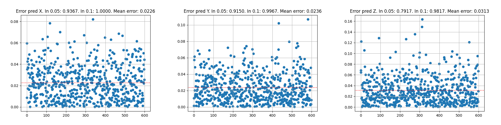

# 使用两个encoder，分别输入rgb和inf模态，将两个模态的信息进行cross attention融合，使用一个decoder进行解码，整体仍为全transformer。
# 平均误差为0.07760080738148342
# Acc X 0.05: 0.9367 Acc X 0.1: 1.0000
# Acc Y 0.05: 0.9150 Acc Y 0.1: 0.9967
# Acc Z 0.05: 0.7917 Acc Z 0.1: 0.9817

